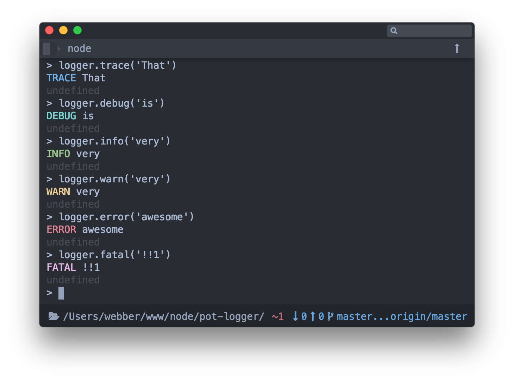

# pot-logger

[](https://travis-ci.org/cantonjs/pot-logger) [](https://circleci.com/gh/cantonjs/pot-logger)

A logger system for pot-js or claypot.



## Getting Started

#### logger

```js
import logger from 'pot-logger';
logger.info('awesome!');
/* => INFO awesome! */
```

#### createLogger

```js
import { createLogger } from 'pot-logger';
const logger = createLogger('food');
logger.info('虾饺');
/* => INFO [food] 虾饺 */
```


## Daemon

By default, logger messages will finaly output by calling `console.log` to terminal, but if `daemon` mode enabled, logger messages will write to `*.log` files.

By default, there are three logs files:

- `out.log`: Default log file. Only valid log level messages will write to this file.
- `err.log`: All `ERROR` or `FATAL` log level messages will write to this file.
- `all.log`: All log level messages will write to this file.

To enable `daemon` mode, call `setConfig('daemon', true)`.


## Installation

```bash
npm i pot-logger
```


## API

#### logger

Default logger. A logger is a little bit like `console`, it has these methods:

- `trace` (blue)
- `debug` (cyan)
- `info` (green)
- `warn` (yellow)
- `error` (red)
- `fatal` (magenta)


###### Ways to import `logger` module

```js
import { logger } from 'pot-logger';
import logger from 'pot-logger'; /* or */
var logger = require('pot-logger').logger; /* or */
var logger = require('pot-logger').default; /* or */
```

---

#### createLogger(category[, color, appender])

Create a custom logger.

###### Arguments

1. `category` (String): Logger category.
2. `color` (String): Category text color. Support all [chalk.js](https://github.com/chalk/chalk) colors. Defaults to `gray`.
3. `appender` (Object): [log4js](https://nomiddlename.github.io/log4js-node/appenders.html) appender.

###### Returns

Returns a new `logger`.

---

#### getLogger(category)

Get logger by category. If not found, it would return the default logger.

###### Arguments

1. `category` (String): Logger category.

###### Returns

Returns a `logger`.

---

#### setConfig(keyOrConfig[, value])

Initialize configure.

###### Arguments

1. `keyOrConfig` (String|Object): Config key or config k/v object.
2. `value` (Any): Only work if the first argument is a `String`.

##### Props

- daemon (Boolean)

If `daemon` is `true`, loggers will use `*.log` files instead of `console`. Defaults to `false`.

###### Example

```js
setConfig('daemon', true);
```

- logLevel (String|Object)

Defining custom log levels. You could set all categories by passing a level string. Or you could to set some individual categories by passing a key/value object. Defaults to "INFO". 

Valid levels: `ALL` < `TRACE` < `DEBUG` < `INFO` < `WARN` < `ERROR` < `FATAL` < `MARK` < `OFF`.

###### Example

```js
setConfig('logLevel', 'DEBUG');
```

- logsDir (String)

Defining log files dir. By default, log files will work only when `daemon` mode enabled. Defaults to `${cwd}/.logs/`.

###### Example

```js
setConfig('logsDir', '/my/logs/path/');
```

- overrideConsole (Boolean)

Override native `console` to `logger`. Defaults to `false`.

###### Example

```js
setConfig('overrideConsole', true);
```


---

#### setLevel([level])

Set level.

###### Arguments

1. `level` (String|Object): Set custom log levels. You could set all categories by passing a level string. Or you could to set some individual categories by passing a key/value object. Defaults to "INFO".

---

#### overrideConsole([logger])

Override native `console`. Notice that `console.log()` will be equal with `logger.info()`.

###### Arguments

1. `logger` (Object): Defining a logger to override `console`.

---

#### resetConsole()

Reset `console` to the native one. Only work after `overrideConsole()` run.

---

#### overrideConsoleInRuntime(startRun[, logger])

Override native `console` in `startRun` function runtime.

###### Arguments

1. `startRun` (Function): Defining an async function to start to override native `console`. When this function ends, `console` will reset to the native one.
2. `logger` (Object): Defining a logger to override `console`.

##### Example

```js
import { overrideConsoleInRuntime } from 'pot-logger';

(async function () {
  console.log('native'); /* => native */

  await overrideConsoleInRuntime(async () => {
    console.log('not native'); /* => INFO not native */
  });

  console.log('native again'); /* => native again */
}());
```


## License

MIT
