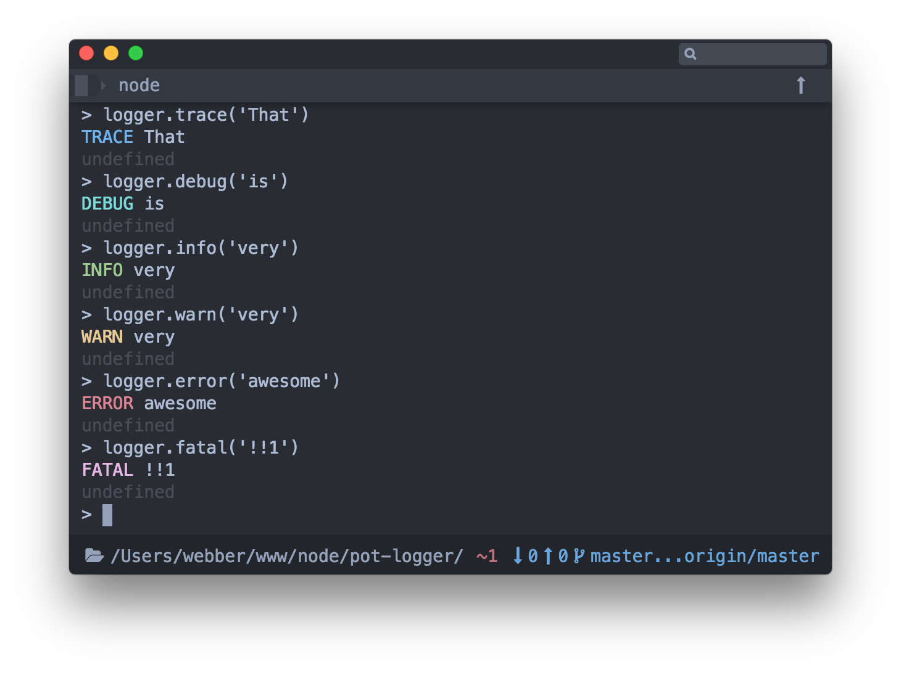
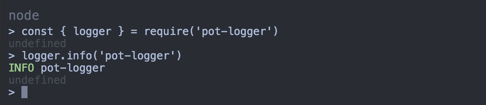
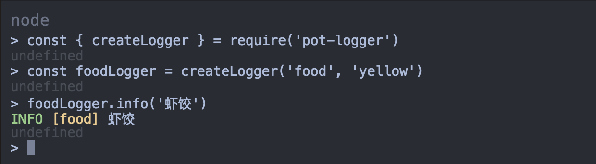
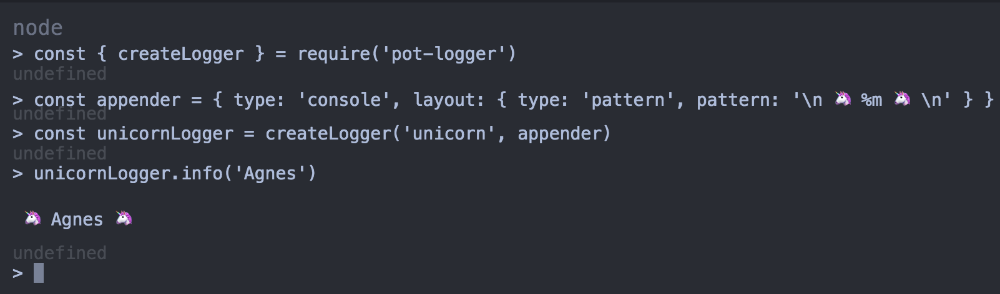

# pot-logger

[](https://travis-ci.org/cantonjs/pot-logger) [](https://circleci.com/gh/cantonjs/pot-logger) [](https://david-dm.org/cantonjs/pot-logger) [](https://github.com/cantonjs/pot-logger/blob/master/LICENSE.md)

A powerful log system for node.js, with zero configuration.




## Table of Contents

<!-- MarkdownTOC autolink="true" bracket="round" -->

- [Features](#features)
- [Getting Started](#getting-started)
- [Daemon](#daemon)
- [Installation](#installation)
- [API](#api)
  - [logger](#logger)
  - [createLogger\(category\[, appenderDescription\]\)](#createloggercategory-appenderdescription)
  - [hasLogger\(category\)](#hasloggercategory)
  - [getLogger\(category\)](#getloggercategory)
  - [setConfig\(keyOrConfig\[, value\]\)](#setconfigkeyorconfig-value)
  - [overrideConsole\(\[logger\]\)](#overrideconsolelogger)
  - [resetConsole\(\)](#resetconsole)
  - [overrideConsoleInRuntime\(startRun\[, logger\]\)](#overrideconsoleinruntimestartrun-logger)
- [Default Appenders](#default-appenders)
  - [defaultDaemonAppender](#defaultdaemonappender)
  - [defaultConsoleAppender](#defaultconsoleappender)
- [Related Projects](#related-projects)
- [License](#license)

<!-- /MarkdownTOC -->


<a name="features"></a>
## Features

- Easy to get started with zero configuration
- Log files with configurable log rolling based on file size or date
- Different log levels
- Different log categories
- Easy to create custom logger
- All [log4js appenders](https://nomiddlename.github.io/log4js-node/appenders.html) are supported
- Replace native console (disabled by default)


<a name="getting-started"></a>
## Getting Started

**logger**

```js
import logger from 'pot-logger';
logger.info('pot-logger');
```



**createLogger with custom color**

```js
import { createLogger } from 'pot-logger';
const foodLogger = createLogger('food', 'yellow');
foodLogger.info('虾饺');
```



All [chalk.js colors](https://github.com/chalk/chalk) are available. You can even use dot-notation to define colors. i.e. `red.bold`.

**createLogger with custom appender**

```js
import { createLogger } from 'pot-logger';
const appender = { type: 'console', layout: { type: 'pattern', pattern: '\n 🦄 %m 🦄 \n' } };
const unicornLogger = createLogger('unicorn', appender);
unicornLogger.info('Agnes');
```



All [log4js appenders](https://nomiddlename.github.io/log4js-node/appenders.html) are available.


<a name="daemon"></a>
## Daemon

By default, logger messages will finaly output by calling `console.log` to terminal, but if `daemon` mode enabled, logger messages will write to `*.log` files.

By default, there are three logs files:

- `out.log`: Default log file. Only valid log level messages will write to this file.
- `err.log`: All `ERROR` or `FATAL` log level messages will write to this file.
- `all.log`: All log level messages will write to this file.

To enable `daemon` mode, call `setConfig('daemon', true)`.


<a name="installation"></a>
## Installation

```bash
npm i pot-logger
```


<a name="api"></a>
## API

<a name="logger"></a>
#### logger

Default logger. A logger is a little bit like `console`, it has these methods:

- `trace` (blue)
- `debug` (cyan)
- `info` (green)
- `warn` (yellow)
- `error` (red)
- `fatal` (magenta)


###### Ways to import `logger` module

```js
import { logger } from 'pot-logger';
import logger from 'pot-logger'; /* or */
var logger = require('pot-logger').logger; /* or */
var logger = require('pot-logger').default; /* or */
```

---

<a name="createloggercategory-appenderdescription"></a>
#### createLogger(category[, appenderDescription])

Create a custom logger.

###### Arguments

1. `category` (String): Logger category.
2. `appenderDescription` (String|Object|Function):
    - (String): Category text color. Support all [chalk.js](https://github.com/chalk/chalk) colors. Supports dot notation (i.e. `red.bold`).
    - (Object): [log4js](https://nomiddlename.github.io/log4js-node/appenders.html) appender.
    - (Function): A function that should return a [log4js appenders](https://nomiddlename.github.io/log4js-node/appenders.html). The only argument of this function is a `ref` object, which includes:
        + `category` (String)
        + `daemon` (Boolean)
        + [defaultDaemonAppender](#defaultdaemonappender) (Object)
        + [defaultConsoleAppender](#defaultconsoleappender) (Object)


###### Returns

Returns a new `logger`.

###### Example

```js
import { createLogger } from 'pot-logger';
const logger = createLogger('test', (ref) => {
    return ref.daemon ? ref.defaultDaemonAppender : ref.defaultConsoleAppender;
});
```

---

<a name="hasloggercategory"></a>
#### hasLogger(category)

Returns a boolean indicating whether a logger with the specified category exists or not.

###### Arguments

1. `category` (String): Logger category.

###### Returns

Returns `true` or `false`.

---

<a name="getloggercategory"></a>
#### getLogger(category)

Get logger by category. If not found, it would return the default logger.

###### Arguments

1. `category` (String): Logger category.

###### Returns

Returns a `logger`.

---

<a name="setconfigkeyorconfig-value"></a>
#### setConfig(keyOrConfig[, value])

    Alias: `setLoggers`

Initialize configure.

###### Arguments

1. `keyOrConfig` (String|Object): Config key or config k/v object.
2. `value` (Any): Only work if the first argument is a `String`.

##### Props

- enable (Boolean)
- daemon (Boolean)
- logLevel (String|Object)
- logsDir (String)
- overrideConsole (Boolean)

##### Props.enable

If `enable` is `false`, no log messages would show, and nothing would write to log files. Defaults to `true`.

###### Example

```js
setConfig('enable', false);
```

##### Props.daemon

If `daemon` is `true`, loggers will use `*.log` files instead of `console`. Defaults to `false`.

###### Example

```js
setConfig('daemon', true);
```

##### Props.logLevel

Defining custom log levels. You could set all categories by passing a level string. Or you could to set some individual categories by passing a key/value object. Defaults to "INFO". 

Valid levels: `ALL` < `TRACE` < `DEBUG` < `INFO` < `WARN` < `ERROR` < `FATAL` < `MARK` < `OFF`.

###### Example

```js
setConfig('logLevel', 'DEBUG');
```

##### Props.logDir

Defining log files dir. By default, log files will work only when `daemon` mode enabled. Defaults to `${cwd}/.logs/`.

###### Example

```js
setConfig('logsDir', '/my/logs/path/');
```

##### Props.overrideConsole

Override native `console` to `logger`. Defaults to `false`.

###### Example

```js
setConfig('overrideConsole', true);
```

---

<a name="overrideconsolelogger"></a>
#### overrideConsole([logger])

Override native `console`. Notice that `console.log()` will be equal with `logger.info()`.

###### Arguments

1. `logger` (Object): Defining a logger to override `console`.

---

<a name="resetconsole"></a>
#### resetConsole()

Reset `console` to the native one. Only work after `overrideConsole()` run.

---

<a name="overrideconsoleinruntimestartrun-logger"></a>
#### overrideConsoleInRuntime(startRun[, logger])

Override native `console` in `startRun` function runtime.

###### Arguments

1. `startRun` (Function): Defining an async function to start to override native `console`. When this function ends, `console` will reset to the native one.
2. `logger` (Object): Defining a logger to override `console`.

###### Example

```js
import { overrideConsoleInRuntime } from 'pot-logger';

(async function () {
  console.log('native'); /* => native */

  await overrideConsoleInRuntime(async () => {
    console.log('not native'); /* => INFO not native */
  });

  console.log('native again'); /* => native again */
}());
```


<a name="default-appenders"></a>
## Default Appenders

<a name="defaultdaemonappender"></a>
#### defaultDaemonAppender

```js
{
  type: 'file',
  filename: defaultCategory,
  maxLogSize: 10485760, // 10MB
  backups: 5,
  compress: true,
}
```

<a name="defaultconsoleappender"></a>
#### defaultConsoleAppender

```js
{
  type: 'console',
  layout: {
    type: 'pattern',
    pattern: '%[%p%] %m',
  },
}
```


<a name="related-projects"></a>
## Related Projects

- [log4js-node](https://github.com/nomiddlename/log4js-node)
- [chalk](https://github.com/chalk/chalk)


<a name="license"></a>
## License

MIT
